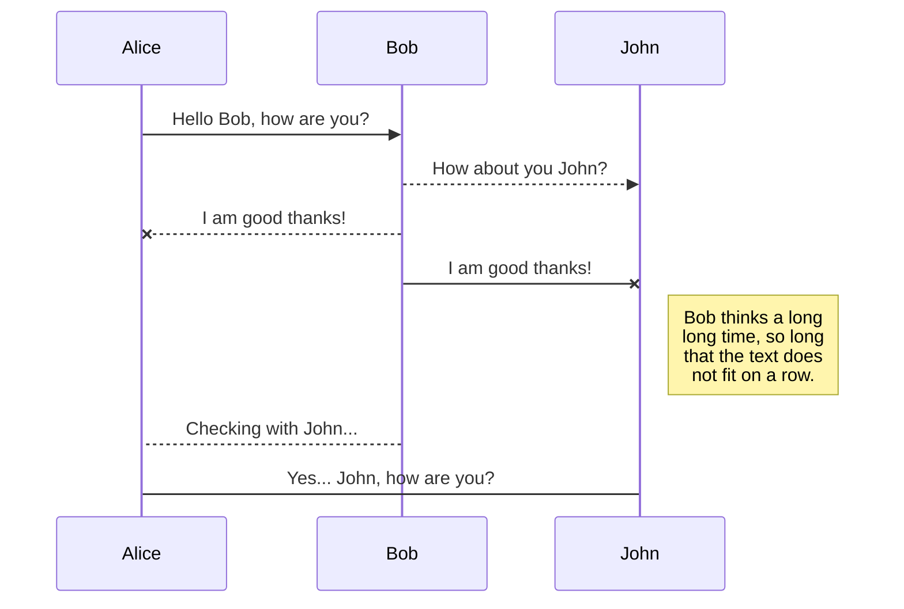

# 見出し1

## 見出し2

### 見出し3

#### 見出し4

おおきに！漁業協同組合とは、漁業者が集まって組織を作り、漁業に関する事業を共同で行う組織のことやで。漁業者が協力して漁獲量を増やし、漁業の安定化や漁業者の生活向上を目指すことが目的やで。また、漁業者の権利や利益を守るために、政府や企業との交渉や調整を行うこともあるんや。漁業協同組合は、日本全国に存在しており、地域の特性に合わせた取り組みを行っているんやで。

- これはひとつめの箇条書き
- ふたつめの箇条書き
  - 一つ階層が深い箇条書き
- みっつめの箇条書き

### コード

3つのバッククォート記号でくくることで、コード例を示します

```scss
@import '../src/style/config';


  @keyframes slideIn {
    0% {
      transform: translateY(10px);
      opacity: 0.1;
    }
    100% {
      transform: translateY(0);
      opacity: 1;
    }
  }
  
  .article-box.new-article {
    animation-name: slideIn;
    animation-duration: 0.2s; // アニメーションの長さを増やします
    animation-timing-function: ease-out; // アニメーションのタイミング関数を変更します
    animation-fill-mode: both;
    opacity: 0;
    will-change: transform, opacity; // 追加
  }
  
  .article-box.new-article.slide-in {
    opacity: 1;
  }
```

```javascript
import { anOldHope as theme } from 'react-syntax-highlighter/dist/esm/styles/hljs';
import { CopyToClipboard } from 'react-copy-to-clipboard';
import { FiClipboard, FiCheck } from 'react-icons/fi';
import './CodeBlock.scss';

interface CodeBlockProps {
  language: string | undefined;
  codeString: string;
}

const CodeBlock: React.FC<CodeBlockProps> = ({ language, codeString }) => {
  const [isCopied, setIsCopied] = useState(false);

  const handleCopy = () => {
    setIsCopied(true);
    setTimeout(() => {
      setIsCopied(false);
    }, 1500);
  };

  const displayLanguage = language ? language.replace("lang-", "") : ""; // lang- をカット

  return (
    <div className="code-block">
        <div className="code-heading">
            <div className="language-name">{displayLanguage}</div> {/* *************************************************************************************displayLanguage を使用 */}
            <div className="copy-button">
                <CopyToClipboard text={codeString} onCopy={handleCopy}>
                <button>
                    {isCopied ? <FiCheck /> : <FiClipboard />}
                    {isCopied ? 'コピーしました' : 'コードをコピー'}
                </button>
                </CopyToClipboard>
            </div>
        </div>
      <SyntaxHighlighter language={language} style={theme}>
        {codeString}
      </SyntaxHighlighter>
      
    </div>
  );
};

export default CodeBlock;
```

```python
# In[1]

def geometric_sum_approximation(a, r, n):
    """
    等比級数 a + ar + ar^2 + ar^3 + ... の近似値を計算する関数
    
    Parameters
    ----------
    a : float
        等比級数の初項
    r : float
        等比級数の公比
    n : int
        級数を打ち切る項数
    
    Returns
    -------
    approx_sum : float
        等比級数の近似値
    """
    approx_sum = 0
    for i in range(n):
        approx_sum += a * (r ** i)
    return approx_sum
```


